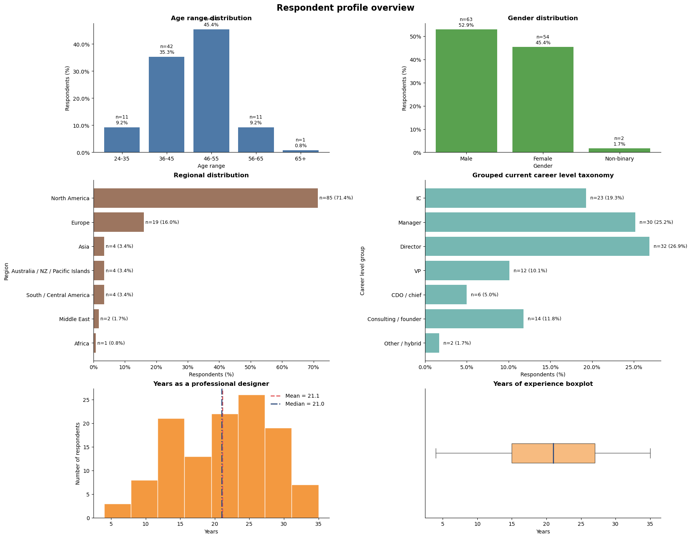
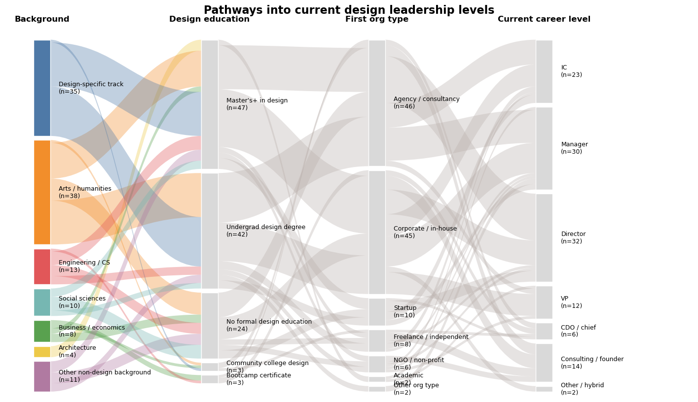
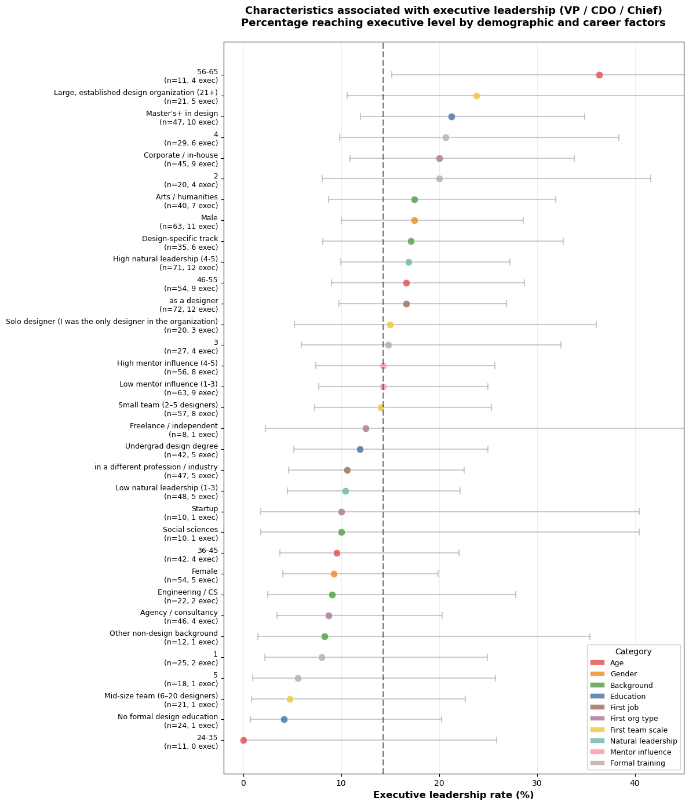
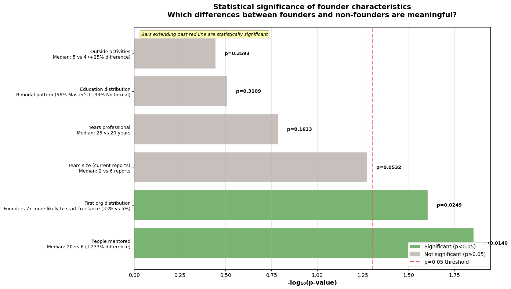
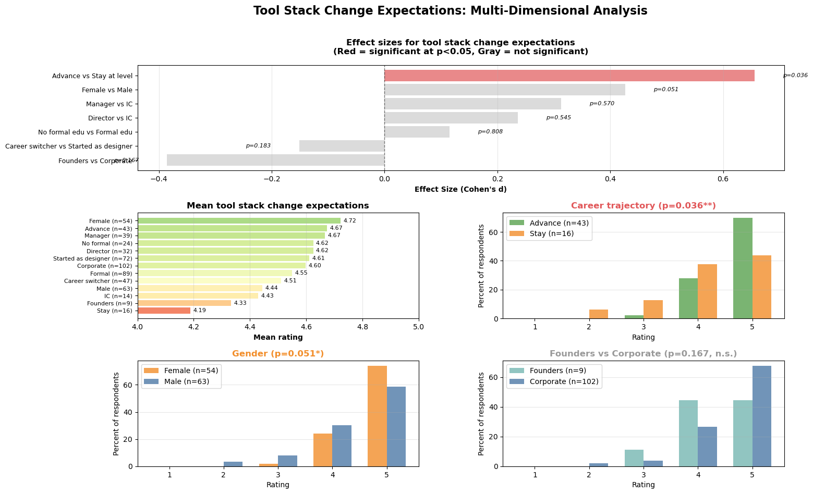

c# Design Leadership Research: Key Findings

**Analysis of 119 design leaders across career levels**

---

## Top 5 Findings

### 1. Demographics Overview

Comprehensive demographic breakdown showing age distribution (45% aged 46-55), regional distribution (71% North America), gender balance (54 female, 63 male), career level distribution, and years of professional experience.

---

### 2. Career Pathways Are Diverse

**Finding:** Multiple pathways exist from background → education → first organization → current career level, with no single dominant path.

Alluvial flow diagram showing how designers move from varied backgrounds through different educational paths and first organizations to reach diverse leadership positions.

---

### 3. Executive Leadership Has Clear Predictors

**Finding:** Age 56-65 (36% executive rate), Master's+ education (21%), and corporate first org (20%) show highest executive attainment rates, compared to baseline of 14.3%.

Comprehensive chart showing executive rates across all demographic and career characteristics—age, education, and corporate context matter most.

---

### 4. Founder Path Diverges Early

**Finding:** First organization type (freelance/NGO vs. corporate/agency) significantly predicts founding (p=0.025), as does mentorship behavior (p=0.014).

Freelance/independent starts show 38% founder rate vs. 4% for agency starts—early independence breeds later independence.

---

### 5. Adaptation is Universal, Ambition Differentiates

**Finding:** Career trajectory (advance vs. stay) is the only significant predictor (p=0.036, d=0.66) of tool stack change expectations—93% of all leaders expect significant change.

Multi-panel analysis showing tool stack expectations across all dimensions—only career ambition differentiates, not role type, background, or education.

---

## Key Insights

### Multiple Paths to Leadership
Career switchers, self-taught designers, and those from varied first organizations all reach mid-level leadership at similar rates—background doesn't predict Manager/Director success.

### Executive Path Has Clear Predictors
Age (56-65 age group), advanced education (Master's+), and corporate context correlate with reaching VP/CDO/Chief levels—this path requires sustained career investment.

### Founder Path Diverges Early
Starting freelance/independent predicts 9x higher founder rates than starting at agencies—early independence breeds later independence, and founders mentor significantly more people.

### Adaptation is Universal
93% of all leaders expect significant tool stack change, with career ambition (not role type) being the only differentiator—successful leaders share an adaptive mindset regardless of path.

### What Doesn't Matter for Mid-Level Leadership
Gender, background (design track vs. career switcher), first team scale, and formal education show no significant barriers to reaching Manager/Director positions—this is where pathway diversity is most evident.

---

## Methodology

**Sample:** 119 design leaders (54 female, 63 male, 2 non-binary)

**Geographic Distribution:** 71% North America, 29% global

**Age Range:** 80% between 36-55 years old

**Career Levels:** IC through CDO/Chief, plus founders/consultants

**Statistical Methods:** Mann-Whitney U tests, Fisher's exact tests, Chi-square tests, Spearman correlations, logistic regression, K-means clustering

**Significance Threshold:** p < 0.05, with trends noted at p < 0.10

**Analysis Tools:** Python (pandas, matplotlib, seaborn, scipy, scikit-learn)

**Data Collection:** Quantitative survey covering demographics, career history, leadership development, and future expectations
